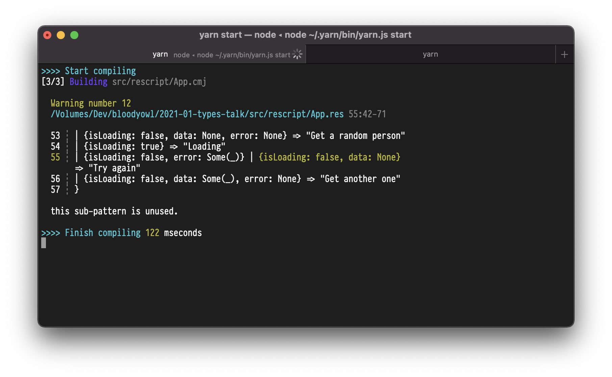

# Simplify your UI management with (algebraic data) types

> A comparison between ReScript & JavaScript, used naively for the same purpose

## First, get the talk slides

https://speakerdeck.com/bloodyowl/simplify-your-ui-management-with-algebraic-data-types

## What to look for

> Instructions to run the project locally are at the end of this file

This repository aims to show the benefits of using typed functional languages.

The main feature we're seing there is the ability to use and create **sum types** using **variants**. 

The app is just an action button thats triggers a call to an API that returns user profiles. To illustrate how the two solutions manage errors and edge-cases, the APIs has been artificially "broken", and returns three possible states:

- An error
- An empty response
- A user profile

Each of these possible states should be treated and the interface should reflect it.

### Action button specification

The action button should:

1. Be labelled "Get a random person" initially
2. Be labelled "Loading" when a request is pending
3. Show "Try again" if the API error or returned an empty response
4. Show "Get another one" when a profile is successfully displayed

### User profile specification

The user profile should:

1. Show nothing initially
2. Show nothing when loading
3. Show "No result was received" when the API returned an empty profile
4. Show "An error occured" when the API errored
4. Show the receive avatar and email when successful

### Naive JavaScript

The [JS implementation](./src/javascript/App.js) represents its state using the following common structure:

```javascript
{
  isLoading: bool,
  data: response?,
  error: error?,
}
```

As visible in [App.js](./src/javascript/App.js), this leads to complex ternary expressions, reducing readability, and leading to impossible states (as it's a **product type**, where its count of possible states is the **product** of its fields).

```javascript
<button onClick={loadNewItem} disabled={user.isLoading}>
  {!user.isLoading && user.data == null && user.error == null
    ? "Get a random person"
    : user.isLoading
    ? "Loading"
    : user.error
    ? "Try again"
    : "Get another one"}
</button>
```

Moreover, when trying the page, you'll notice that this naive implementation fails to respect the specification, as it makes different states indistinguishable (e.g. "received an empty response" vs "nothing happened yet"). These issues would require us to whether:

1. Manage additional state (e.g. a `receivedUserInput` boolean)
2. Wrap `data` in an additional data structure (e.g. `{payload: data}`, so that we're able to compare it to the initial `null` value)

### Naive ReScript

The [ReScript implementation](./src/rescript/App.res) represents its state as follows:

```rescript
AsyncData.t<
  result<
    option<RandomUser.t>,
    error
  >
>
```

Let's break that down. 

```rescript
// AsyncData
type t<'a> =
  | NotAsked
  | Loading
  | Done('a)

// Result
type t<'a, 'b> =
  | Ok('a)
  | Error('b)

// Option
type t<'a> =
  | Some('a)
  | None
```

Those are all **sum types**: their possible state count is the **sum** of their branches. That enables two main benefits:

- It leads to **readable blocks** when exploding their values
- It enables the compiler to easily notice **unhandled cases** and make us fix those

```rescript
<button onClick={_ => loadNewItem()} disabled={user == Loading}>
  {React.string(
    switch user {
    | NotAsked => "Get a random person"
    | Loading => "Loading"
    | Done(Error(_) | Ok(None)) => "Try again"
    | Done(Ok(Some(_))) => "Get another one"
    },
  )}
</button>
```

If we try in ReScript to represent the data in the same way our JS application works, it would even show us the source of the bug:

```rescript
type state<'a, 'b> = {
  isLoading: bool,
  data: option<'a>,
  error: option<'b>,
}

let getButtonWording = x =>
  switch x {
  | {isLoading: false, data: None, error: None} => "Get a random person"
  | {isLoading: true} => "Loading"
  | {isLoading: false, error: Some(_)} | {isLoading: false, data: None} => "Try again"
  | {isLoading: false, data: Some(_), error: None} => "Get another one"
  }
```

Here's the warning it gives: showing us that this data representation doesn't enable us to fit the specification as two states we need to distinguish have the exact same representation.



There you go! Don't hesitate to play with this repository and move some code around to experiment.

---

## Installation

```sh
$ git clone git@github.com:bloodyowl/2020-10-types-talk.git
$ cd 2021-01-types-talk
$ yarn
```

## Start

```sh
$ yarn js # run babel
$ yarn start
```

And in another terminal tab

```sh
$ yarn serve
```

- http://localhost:8080/src/rescript
- http://localhost:8080/src/javascript

